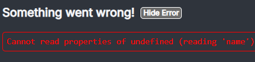
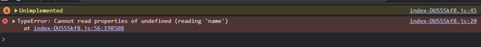
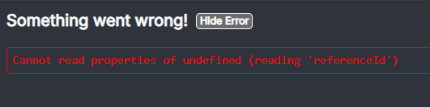
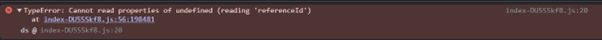
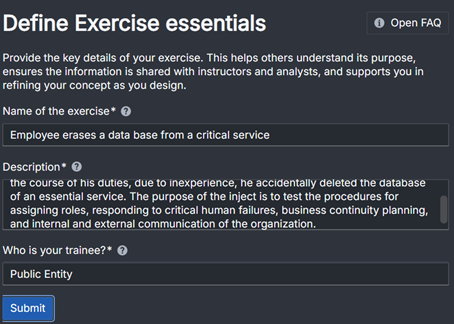
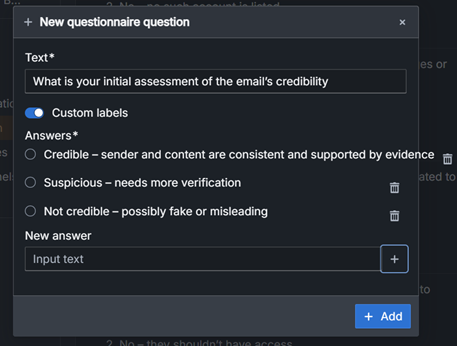

# Errors
 1. After adding a connection to a questionnaire that we assume that was a wrong connection, and also when we tried to change the predefined inject, of the type questionnaire, on a learning activity from the default to other questionnaire, this happened:
      
 3. Then we also tried to erase the inject predefined to check if that was the problem, and after doing that every time we tried to enter in the inject specification area, the error stopped me from entering in it.
If this happens it can become a problem because if the person can’t manage to correct the mistake that he did to trigger this error, he won’t get to do anything else. He will need to restart the exercise from scratch if is injects aren’t all already specified at least.
We also tried to refresh the page multiple times.
     
# Bugs
 1. After pressing submit nothing happens, however if we press the next button, it saves and continues without any problems.
    
 3. If we write something bigger than the intended text box in questions the text will go out of the box.
    
# Questions
 What is the purpose of the submit button?
# Observations
 We noticed that now we can make different answers for the same tool in  a more simple and easy way, that's good.
 We noticed that we can't use "," in questions, but we would like to do it.
